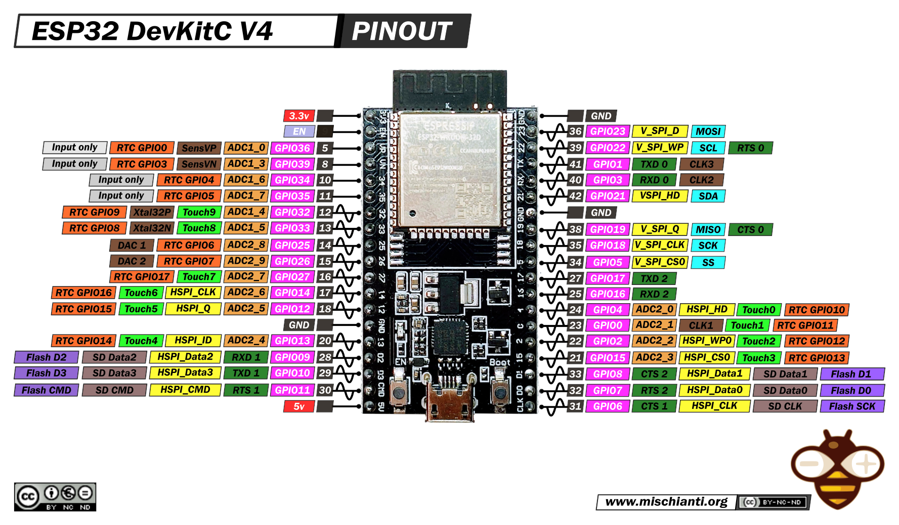

## IFRIT_WARDRIVING_ESP32
<!-- <table> -->
<!--   <tr> -->
<!--     <td></td> -->
<!--     <td></td> -->
<!--   </tr> -->
<!-- </table> -->

__IFRIT__ is a versatile toolkit for wireless penetration testing, offering a range of powerful tools. One of its key features is __wardriving__, which is designed for real-time Wi-Fi network mapping and geolocation.
<br><br>
 
<br><br>
 

### 🌟 Features 
- Real-time WIFI network mapping and geolocation
- Full Mac_Addrs randomization in both Access point mode and Station mode
- All data is saved in __`log_Wardriving.csv`__ as csv format
- Scanned network MAC addresses are stored in bssids_db.db to avoid adding duplicates to __`log_Wardriving.csb`__
- See all information from TFT screen or by accessing the Web UI by connection to esp33 AP 
- Python code to visualise all `log_Wardriving.csv` data as html map 

### Code Structure
```bash
IFRIT_Wardriving
├── imgs
│   ├── map.jpg
│   └── preview.jpg
├── include
│   ├── Ap_Dns_Webserver.h
│   ├── Config.h
│   ├── Html_code.h
│   ├── Wardriving_Tasks.h
│   └── Wardriving_Utilities.h
├── lib
│   └── README
├── platformio.ini
├── README.md
├── src
│   └── main.ino
├── test
└── Wardrivingmap2Map
    ├── creat_random_Wardriving_csv.py
    ├── example.csv
    ├── pyproject.toml
    ├── README.md
    ├── requirements.txt
    ├── uv.lock
    └── wardriving_map_visualizer.py

7 directories, 18 files
```
### Esp32 Pinout 
 
### TFT Pinout
 
### TFT Wiring
| Pin Name | ESP32 GPIO |
|----------|------------|
| VCC      | 3.3V       |
| GND      | GND        |
| CS       | GPIO 15    |
| RESET    | GPIO 4     |
| DC/RS    | GPIO 2     |
| MOSI     | GPIO 23    |
| SCK      | GPIO 18    |
| LED      | GPIO 27    |
| MISO     | GPIO 19    |
| T_CLK    | GPIO 18    |
| T_CS     | GPIO 21    |
| T_DIN    | GPIO 23    |
| T_DO     | GPIO 19    |
| T_IRQ    | GPIO Empty |
| SD_CS    | GPIO 5     |
| SD_MOSI  | GPIO 23    |
| SD_MISO  | GPIO 19    |
| SD_SCK   | GPIO 18    |
### NEO-8M GPS Module Pinout

### NEO-8M Wiring
| NEO-8M Pin | ESP32 GPIO |
|------------|------------|
| VCC        | 3.3V or 5V |
| GND        | GND        |
| TX         | GPIO 16    |
| RX         | GPIO 17    |

<br> 

> **Note:** You can use other GPS modules such as the NEO-6M or NEO-7M, as long as they communicate over UART. However, the NEO-8M is recommended due to its higher speed and better accuracy.

 
### Power Management Circuit Setup
 
### 🛠️ Configurations
You can configure the full project from __`include/Config.h`__ :
```cpp 
#define SD_CS 5
#define GPS_RX 16
#define GPS_TX 17
#define GPS_BAUD 9600
#define GPS_DATA_TIMEOUT 3000
#define MIN_SATELLITE 4 

#define TIMEOUT_MS 120 // scanning 13 channel will takes  1.56 second  // 120 ms BTW
#define BSSID_MAX_TFT_LINE 5

#define SD_CARD_MAX_FAILING 4
#define BACKGROUND_COLOR TFT_BLACK
#define TEXT_COLOR TFT_GREEN

#define PWM_FREQ     5000
#define PWM_RES      8
#define LED_PIN 12 
#define LED_DELAY 30

#define RST_PIN 27 

#define MAX_BRIGHTNESS   255
#define MIN_BRIGHTNESS   0


#define SSID_AP "iPhone 16 Pro Max"
#define PASSWD "!@DoIt1984"

#define WEBPAGE_DELAY 1500
#define WEBPAGE_TITLE "IFRIT Wardriving v 1.7.2"

typedef struct {
  double latitude;
  double longitude;
  double altitude;
  double speed;
  int satellites;
  char timeString[9];
  char Date[15];
  int hdop;
} gps_data_t;
```

### Accessing the Web UI  
 <br><br> 
Connect to the **`iPhone 16 Pro Max`** Wi-Fi AP and enter the password **`!@DoIt1984`**.  

- For Android/iPhone users: by default, when you connect to the AP, you will be redirected to the **captive portal**. If the portal doesn't appear automatically, open a browser and go to **`192.168.1.1`**.  
- For laptop users: the **captive portal** may not open automatically, so you need to manually open a browser and navigate to **`192.168.1.1`** to access the Web UI.  
> **Remark:** you can change the AP name and password in __`include/Config.h`__
### 👀 Visualizing Wardriving Data on a Map 

For this purpose, I created the script __`Wardrivingmap2Map/wardriving_map_visualizer.py`__ which displays wardriving data on an interactive map.

- __Installing requirements__ using uv:
```bash
cd Wardrivingmap2Map/wardriving_map_visualizer.py  
  # Install requirements
uv sync 
# for linux users
source .venv/bin/activate
# for windows users 
source .venv/bin/activate.bat
```
- __Installing requirements__ using pip:
```bash
python -m venv .venv 
# for linux users
source .venv/bin/activate
# for windows users 
source .venv/bin/activate.bat

pip install -r requirements.txt 
```
- __Run following command to visulize log_Wardriving.csv data on map__:
```bash
python wardriving_map_visualizer.py --open_in_browser --use_google_maps log_Wardriving.csv
```
 
- __Help Menu__:
```bash
py wardriving_map_visualizer.py --help 
usage: wardriving_map_visualizer.py [-h] [--print_data {True,False,true,false,1,0}] [--open_in_browser] [--use_google_maps]
                                    [--enable_clustering {True,False,true,false,1,0}] [--output OUTPUT] [--satellite_view] [--max_zoom MAX_ZOOM]
                                    [--zoom_start ZOOM_START] [--filter FILTER] [--get_all]
                                    csv_file

generate and view a wardriving map from csv data.

positional arguments:
  csv_file              path to the csv file containing the wardriving data.

options:
  -h, --help            show this help message and exit
  --print_data {True,False,true,false,1,0}
                        0/false: print the csv data and exit without saving, 1/true: print the csv data and save html_map
  --open_in_browser     open the generated html map in the browser.
  --use_google_maps     use google maps layout instead openstreetmap.
  --enable_clustering {True,False,true,false,1,0}
  --output OUTPUT, -o OUTPUT
                        path to save the generated html map.
  --satellite_view      use satellite view for the map "only available for google map layout".
  --max_zoom MAX_ZOOM   set the maximum zoom level for the map.
  --zoom_start ZOOM_START
                        set the zoom level for the map.
  --filter FILTER, -f FILTER
                        filtering data on map (example "Encryption:OPEN")
  --get_all             search for and return all entries containing the specified substring (case-insensitive) and [it works only with --filter/-f]
                        parm.
```
### © LICENSE
This project is licensed under the MIT License.
<!-- 
I love Pitaya :]
find me: aHR0cHM6Ly9jcmVhdGlvbnMubXRkdi5tZS9hcnRpY2xlcy9CeXBhc3NpbmctZ29vZ2xlLXR3by1mYWN0b3ItYXV0aGVudGljYXRpb24=
;]
-->

